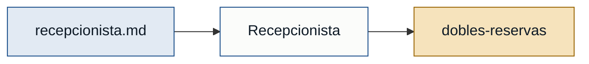
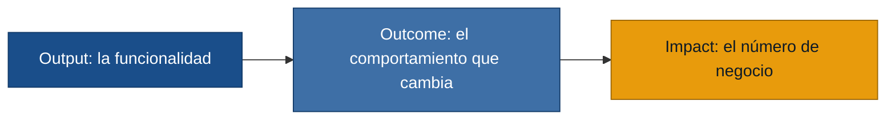
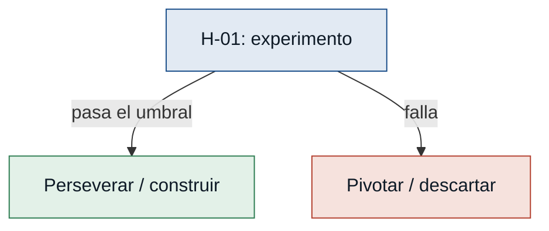

# Skill: discovery

Conocimiento empaquetado para convertir entrevistas en artefactos de producto.
Cada artefacto tiene un formato fijo. Respétalo al pie de la letra: la
consistencia es lo que permite que el resto del proceso (y el gate) funcione.

## Principio rector

Trazabilidad sobre todo. Toda afirmación cita su entrevista fuente por nombre de
archivo. Lo que no tiene fuente, no se escribe; a lo sumo se marca como hipótesis
pendiente de validar.

## 1. Persona

Una persona representa un tipo de usuario/actor real, no a un individuo. Formato:

```markdown
### <Nombre genérico> — <rol>
- **Contexto:** quién es, en una frase.
- **Objetivo principal:** qué quiere lograr con el sistema.
- **Dolores:** lista; cada dolor cita su fuente, p. ej. "(recepcionista.md)".
- **Respaldo:** `primera mano` si existe entrevista propia de ese rol;
  `referenciada` si solo aparece mencionada por otros.
```

Regla dura: una persona con respaldo `referenciada` NO puede sustentar un MVP.
Hay que conseguir su entrevista de primera mano.

## 2. Stakeholder

Actor con interés en el sistema, aunque no lo use a diario (dueño, regulador).

```markdown
### <Rol del stakeholder>
- **Interés en el sistema:** qué espera obtener o proteger.
- **Fuente:** archivo(s) de entrevista que lo evidencian.
```

## 3. Requisito candidato

```markdown
- **[R-NN]** <enunciado breve y verificable>.
  - Tipo: funcional | no funcional
  - Origen: <archivo.md> · <persona/stakeholder>
```

Numera correlativo (R-01, R-02…). Un requisito no funcional (rendimiento,
seguridad, disponibilidad) se marca como tal.

## 4. User story (formato INVEST)

```markdown
- **[US-NN]** Como <persona>, quiero <acción> para <beneficio>.
  - Criterios de aceptación:
    - Dado <contexto>, cuando <acción>, entonces <resultado esperado>.
  - Fuente: <archivo.md>
```

Las historias deben ser **I**ndependientes, **N**egociables, **V**aliosas,
**E**stimables, **S**mall (pequeñas) y **T**estables. Si una historia no se puede
probar, reescríbela.

## 5. MVP Canvas

```markdown
## MVP Canvas — <nombre del producto>

| Bloque | Contenido |
|---|---|
| Propuesta de valor | El cambio concreto que promete el MVP. |
| Segmento de usuarios | Personas a las que sirve primero. |
| Funcionalidades mínimas | Lo imprescindible para entregar la propuesta. |
| Resultado esperado (outcome) | Qué comportamiento debe cambiar. |
| Métrica de éxito | Indicador honesto, no de vanidad. |
| Riesgos / supuestos | Lo que aún hay que validar. |
| Fuera de alcance (por ahora) | Lo que NO entra, y por qué. |
```

La métrica de éxito debe pasar la prueba ácida: si sube, alguien del negocio debe
poder decir qué decisión cambia. Nada de "features lanzadas" ni "líneas de código".

## 6. evidence-map.json (artefacto de auditoría — obligatorio)

`/discovery:analyze` DEBE escribir `<discovery>/outputs/evidence-map.json`. Es lo que el gate
de readiness audita de forma independiente. Esquema:

```json
{
  "personas": [
    { "name": "M. (recepcionista)", "role": "recepcionista", "primary": true }
  ],
  "pains": [
    { "id": "dobles-reservas", "source": "recepcionista.md" }
  ]
}
```

- `role` debe coincidir (en minúsculas) con el `rol_entrevistado` del frontmatter
  de la entrevista que respalda a esa persona, si existe.
- `primary: true` para personas centrales del MVP; `false` para secundarias.
- `source` de cada dolor es el nombre de archivo de la entrevista que lo
  evidencia. Si un dolor proviene de varias, elige la fuente principal.
- Marca a una persona como primaria aunque solo esté `referenciada`: el gate
  detectará la falta de respaldo de primera mano y lo exigirá. No la ocultes
  para "pasar" el gate; eso viola la regla de cero invención.

---

## 7. Hipótesis y experimentos

Fase posterior al MVP. Convierte los supuestos riesgosos del MVP Canvas en
hipótesis falsables y diseña cómo probarlas barato. Marco: output→outcome→impact
unidos por hipótesis (se comprueban), y "comprar información barata" sobre el
riesgo mayor antes de construir.

### Test card (formato legible — `<discovery>/outputs/hypotheses.md`)

```markdown
### [H-NN] <título corto del supuesto> — riesgo: alto | medio | bajo
- **Supuesto a probar:** el salto de fe del que depende el MVP.
- **Hipótesis:** Creemos que <persona> logrará <outcome> si <acción/cambio>,
  porque <razón>.
- **Señal medible:** la métrica de negocio que observaremos (nunca de vanidad).
- **Criterio de éxito:** umbral concreto, con número o porcentaje y plazo.
- **Experimento:** el test más barato que responde (tipo + descripción breve).
- **Caja de tiempo/costo:** cuánto invertimos como máximo para aprender.
- **Regla de decisión:** Si pasa → …; si falla → … (perseverar/pivotar/descartar).
```

Ordena las test cards de mayor a menor riesgo: primero se prueba lo que más
puede tumbar el MVP.

### Tipos de experimento (del más barato al más caro)

- **Entrevista / encuesta dirigida:** valida deseabilidad o un dolor declarado.
- **Fake door:** un botón/enlace a algo que aún no existe; mide intención real.
- **Smoke test / landing:** una página que ofrece la solución; mide demanda.
- **Mago de Oz / Concierge:** el valor se entrega a mano detrás de bambalinas;
  valida deseabilidad sin construir el sistema.
- **Prototipo:** desechable (responder una duda) o evolutivo (crece a producto).
- **A/B:** compara dos variantes con tráfico real; valida un cambio concreto.

Elige el más barato que despeje el riesgo. No construyas para aprender lo que una
entrevista o un fake door responden en días.

### experiment-board.json (artefacto de auditoría — obligatorio)

`/discovery:experiments` DEBE escribir el `experiment-board.json` del discovery. Es lo que
audita el gate de hipótesis. Esquema:

```json
{
  "hypotheses": [
    {
      "id": "H-01",
      "assumption": "supuesto riesgoso del MVP que se pone a prueba",
      "hypothesis": "Creemos que … si … porque …",
      "metric": "señal medible de negocio (no de vanidad)",
      "threshold": "criterio de éxito con número/porcentaje y plazo",
      "experiment": "tipo + descripción del test más barato",
      "decision": "si pasa →…; si falla →… (debe contemplar el fallo)"
    }
  ]
}
```

Reglas duras que el gate hace cumplir:
- Todos los campos presentes y no vacíos.
- `threshold` contiene un número o porcentaje (criterio concreto, no "muchos").
- `decision` dice explícitamente qué hacer **si falla** (pivotar/descartar/…).
- `metric` no es de vanidad (descargas, líneas de código, story points, likes…).
  Prueba ácida: si la métrica sube, ¿alguien del negocio puede decir qué decisión
  cambia? Si no, es vanidad.

---

## 8. Color y diagramas (para que se entienda mejor)

Los artefactos deben ser legibles a simple vista. Dos mecanismos:

### Diagramas Mermaid embebidos en los .md

Incluye diagramas Mermaid en los artefactos Markdown; se renderizan con color en
GitLab, GitHub, VS Code y Obsidian. Usa `classDef` para codificar color.

**En `personas.md` — mapa de trazabilidad** (entrevistas → personas → dolores):



**En `mvp-canvas.md` — el puente output→outcome→impact** (la idea de la dia. 15):



**En `hypotheses.md` — árbol de decisión del experimento**:



### Convención de color (consistente con las diapositivas)

- **Respaldo de persona:** primera mano = verde · referenciada = ámbar.
- **Riesgo de hipótesis:** alto = rojo · medio = ámbar · bajo = verde. Añade el
  campo `risk` ("alto"|"medio"|"bajo") a cada hipótesis del `experiment-board.json`.
- **Cadena de valor:** output = azul · outcome = azul medio · impact = ámbar.
- **Vínculo dolor↔persona:** añade el campo opcional `persona` a cada dolor del
  `evidence-map.json` para poder agruparlos por persona en el reporte.

### Reporte HTML visual

Tras generar los artefactos, `/discovery:report <discovery>` produce
`<discovery>/outputs/report.html`: un dashboard a color (personas, cadena de valor
y tablero de experimentos por riesgo) generado de forma determinista desde los
JSON. Es autocontenido y se abre en cualquier navegador.
