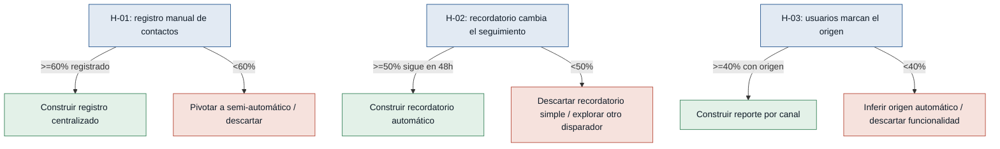

# Hipótesis y experimentos — SierraLabs

Supuestos riesgosos tomados de "Riesgos / supuestos" en `mvp-canvas.md`,
convertidos en hipótesis falsables. Ordenadas de mayor a menor riesgo: primero
se prueba lo que más puede tumbar el MVP.

### [H-01] Registro manual de contactos — riesgo: alto
- **Supuesto a probar:** las consultoras independientes y propietarios de pyme
  registrarán manualmente en una herramienta nueva los contactos que hoy les
  llegan por WhatsApp, en vez de seguir manejándolos solo en el chat.
- **Hipótesis:** Creemos que las consultoras independientes y propietarios de
  pyme registrarán manualmente sus contactos de WhatsApp en una herramienta
  nueva si el registro toma menos de 1 minuto por contacto, porque hoy
  reconocen que los prospectos se les "pierden" por falta de organización
  (consultora.md, propietario.md).
- **Señal medible:** porcentaje de los contactos reales recibidos por WhatsApp
  durante la semana piloto que el usuario efectivamente registra en la
  herramienta, comparado con los que reporta haber recibido.
- **Criterio de éxito:** al menos 60% de los contactos reportados quedan
  registrados durante la semana piloto.
- **Experimento:** Concierge/Mago de Oz — se entrega a 5 participantes una
  plantilla simple (hoja de cálculo o formulario) para registrar cada contacto
  de WhatsApp durante una semana; al cierre se compara contra lo reportado.
- **Caja de tiempo/costo:** 1 semana, sin desarrollo (solo plantilla).
- **Regla de decisión:** Si pasa (≥60%) → construir el registro centralizado
  como funcionalidad central del MVP; si falla (<60%) → pivotar hacia un
  mecanismo semi-automático (p. ej. forward de WhatsApp) o descartar el
  registro manual como mecanismo central.

### [H-02] El recordatorio cambia el comportamiento de seguimiento — riesgo: alto
- **Supuesto a probar:** un recordatorio de seguimiento hace que el usuario
  efectivamente vuelva a contactar al prospecto, en vez de ser solo una
  notificación ignorada.
- **Hipótesis:** Creemos que un recordatorio enviado cuando un contacto lleva 3
  días sin actividad hará que la consultora o el propietario de pyme le dé
  seguimiento, porque hoy admiten que los contactos "desaparecen" sin que nadie
  vuelva a escribirles (consultora.md, propietario.md).
- **Señal medible:** porcentaje de contactos recordados que reciben al menos un
  mensaje de seguimiento del usuario dentro de las 48 horas posteriores al
  recordatorio.
- **Criterio de éxito:** al menos 50% de los contactos recordados reciben
  seguimiento dentro de 48 horas, frente a una tasa base sin recordatorio
  medida en la primera semana del piloto.
- **Experimento:** Mago de Oz — durante 2 semanas, el equipo envía manualmente
  un recordatorio cuando un contacto lleva 3 días sin actividad, y anota si el
  participante responde al prospecto dentro de 48 horas.
- **Caja de tiempo/costo:** 2 semanas, sin desarrollo (recordatorio manual).
- **Regla de decisión:** Si pasa (≥50%) → construir el recordatorio automático
  como funcionalidad del MVP; si falla (<50%) → descartar el recordatorio
  simple y explorar otro disparador (canal distinto, mayor insistencia) antes
  de construirlo.

### [H-03] Los usuarios marcan el origen del contacto — riesgo: medio
- **Supuesto a probar:** los usuarios marcarán el origen (campaña/publicación)
  de cada contacto y si se convirtió en cliente, dato indispensable para el
  reporte de conversión por canal.
- **Hipótesis:** Creemos que los usuarios completarán el campo de origen al
  registrar un contacto si es opcional y rápido de llenar, porque declaran que
  hoy no saben qué canal realmente les genera clientes (consultora.md,
  propietario.md).
- **Señal medible:** porcentaje de los contactos registrados durante el piloto
  que incluyen el campo de origen completado.
- **Criterio de éxito:** al menos 40% de los contactos registrados durante las
  2 semanas de piloto incluyen el origen marcado.
- **Experimento:** Smoke test sobre el mismo prototipo de H-01/H-02 — se agrega
  un campo opcional "origen" a la plantilla y se mide cuántas filas lo
  completan al cierre del piloto.
- **Caja de tiempo/costo:** se mide dentro del mismo piloto de 2 semanas, sin
  costo adicional.
- **Regla de decisión:** Si pasa (≥40%) → construir el reporte de conversión
  por origen como parte del MVP; si falla (<40%) → pivotar a inferir el origen
  de forma automática (enlace o código único por canal) o descartar la
  funcionalidad en esta iteración.
