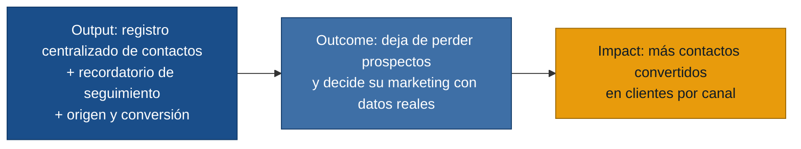

# MVP Canvas — SierraLabs

## Por qué este alcance

De las tres personas entrevistadas, dos comparten el mismo dolor central:
contactos que llegan por WhatsApp sin organización (`seguimiento-desorganizado`,
`contactos-sin-organizar`) y ninguna forma de saber si esa actividad de
marketing realmente genera clientes (`publicidad-sin-medicion`,
`sin-medicion-resultados`, `bajo-impacto-en-ventas`). Ese es el núcleo de valor
del MVP. El Coordinador Administrativo tiene un problema distinto —mantener un
sitio institucional (R-01 a R-04)— que no se repite en las otras personas, así
que queda fuera del MVP inicial.

| Bloque | Contenido |
|---|---|
| Propuesta de valor | Organizar los contactos que ya llegan por WhatsApp/redes y mostrar qué origen realmente convierte en clientes, para dejar de perder prospectos y de decidir el marketing por intuición. |
| Segmento de usuarios | Consultora Independiente y Propietario de Pyme (primera mano, dolor compartido). Coordinador Administrativo no comparte este dolor y no entra en este MVP. |
| Funcionalidades mínimas | (1) Registro centralizado de contactos con estado y fecha de ingreso. (2) Recordatorio de seguimiento cuando un contacto lleva N días sin actividad. (3) Registro del origen del contacto (canal/campaña/publicación) y marca de conversión a cliente. (4) Reporte de contactos y conversiones por origen en un rango de fechas. |
| Resultado esperado (outcome) | Los usuarios dejan de perder prospectos por falta de seguimiento, y empiezan a decidir en qué canal invertir su tiempo según conversiones reales en vez de likes, clics o intuición. |
| Métrica de éxito | % de contactos registrados que reciben al menos un seguimiento dentro de las 48 horas siguientes a su ingreso. Prueba ácida: si baja, indica que el recordatorio no está funcionando y hay que rediseñarlo o investigar por qué los usuarios no actúan; si sube, valida que centralizar y recordar sí cambia el comportamiento de seguimiento (el problema reportado en consultora.md y propietario.md). |
| Riesgos / supuestos | (a) Los usuarios registrarán manualmente sus contactos en el sistema — no hay evidencia de integración automática con WhatsApp. (b) Marcar el origen del contacto y su conversión a cliente requiere disciplina nueva; no hay evidencia de que lo hagan hoy. (c) No está validado si el problema de Coordinador Administrativo (mantenimiento de sitio institucional) pertenece al mismo producto o es un segmento/producto aparte. |
| Fuera de alcance (por ahora) | CMS/edición de sitio web institucional, rendimiento móvil y rediseño visual (R-01 a R-04, dolor exclusivo de Coordinador Administrativo). Construcción de un canal propio de generación de leads (R-05) — primero se valida si organizar lo que ya llega resuelve el problema. Recordatorios de cadencia de publicación en redes (R-08) — solo lo pidió una persona. Integración técnica automática con WhatsApp — se empieza con registro manual para aprender más rápido y más barato. |
