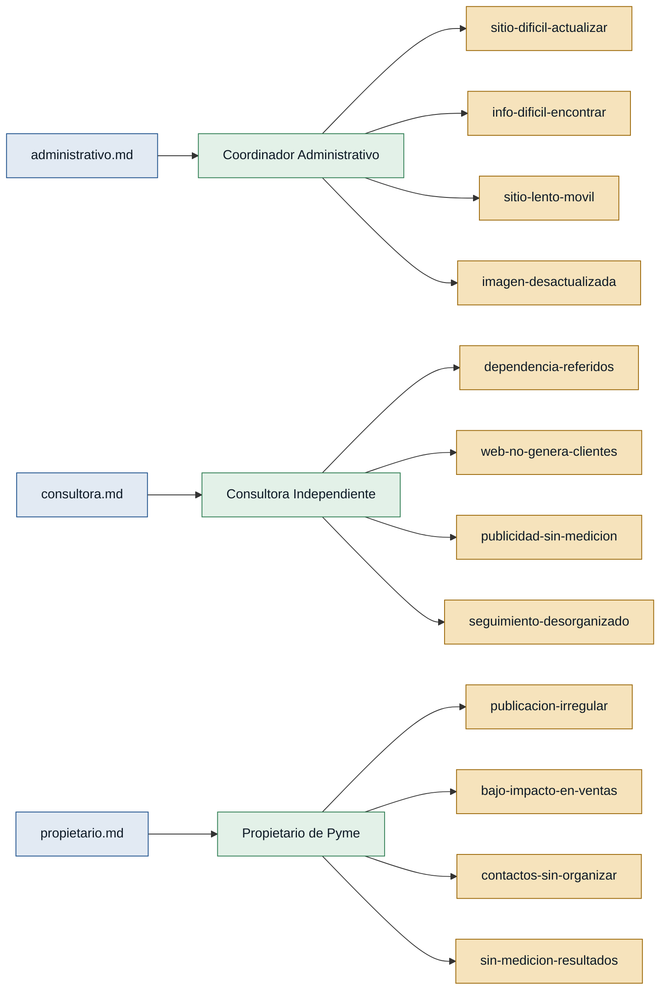

# Personas y stakeholders — SierraLabs

Evidencia: 3 entrevistas en `interviews/` (`administrativo.md`, `consultora.md`,
`propietario.md`), todas en primera persona. Cada persona identificada tiene
entrevista propia, por lo que las tres quedan con respaldo `primera mano`.

## Mapa de trazabilidad

## Personas

### Coordinador Administrativo — gestor de sitio web institucional
- **Contexto:** coordina el contenido del sitio web de una organización; depende
  de soporte técnico o de personal que conozca la plataforma para hacer cambios
  (administrativo.md).
- **Objetivo principal:** que cualquier persona autorizada pueda actualizar el
  contenido fácilmente, que el sitio sea más rápido y que los usuarios encuentren
  la información sin tener que contactar a la organización (administrativo.md).
- **Dolores:**
  - `sitio-dificil-actualizar`: actualizar contenido depende de soporte técnico o
    de alguien que conozca la plataforma (administrativo.md).
  - `info-dificil-encontrar`: usuarios no encuentran fácilmente la información, y
    consultan por documentos que ya están publicados (administrativo.md).
  - `sitio-lento-movil`: el sitio es lento, especialmente desde dispositivos
    móviles (administrativo.md).
  - `imagen-desactualizada`: secciones del sitio ya no reflejan la imagen actual
    de la organización (administrativo.md).
- **Respaldo:** primera mano.

### Consultora Independiente — profesional freelance que depende de referidos
- **Contexto:** ofrece servicios de consultoría; la mayoría de sus clientes llegan
  por recomendación de clientes antiguos (consultora.md).
- **Objetivo principal:** un sistema que ayude a generar clientes de forma más
  estable y que recuerde hacer seguimiento a las personas interesadas
  (consultora.md).
- **Dolores:**
  - `dependencia-referidos`: cuando las recomendaciones se detienen, prácticamente
    no entra ningún cliente nuevo (consultora.md).
  - `web-no-genera-clientes`: tiene página web pero casi no la actualiza y nunca
    le ha generado clientes directamente (consultora.md).
  - `publicidad-sin-medicion`: probó campañas digitales pero no entendía si
    realmente generaban ventas, solo veía clics y números sueltos (consultora.md).
  - `seguimiento-desorganizado`: los contactos llegan por WhatsApp y, sin un
    proceso organizado, muchas veces "desaparecen" sin seguimiento (consultora.md).
- **Respaldo:** primera mano.

### Propietario de Pyme — dueño de negocio que gestiona redes sociales
- **Contexto:** publica en redes sociales del negocio de forma irregular, según
  el tiempo disponible, y responde personalmente los contactos por WhatsApp
  (propietario.md).
- **Objetivo principal:** tener claridad de dónde vienen los clientes y no
  depender de publicar por intuición (propietario.md).
- **Dolores:**
  - `publicacion-irregular`: publican cuando pueden; hay semanas sin ninguna
    publicación por estar ocupados atendiendo el negocio (propietario.md).
  - `bajo-impacto-en-ventas`: hay likes y comentarios, pero pocas ventas directas
    (propietario.md).
  - `contactos-sin-organizar`: los contactos interesados llegan por WhatsApp sin
    ninguna base de datos organizada (propietario.md).
  - `sin-medicion-resultados`: no tienen claro si las publicaciones o campañas
    terminan generando ingresos reales (propietario.md).
- **Respaldo:** primera mano.

## Stakeholders

La evidencia disponible no permite identificar con respaldo claro stakeholders
adicionales (p. ej. dueños del negocio detrás de SierraLabs, reguladores, etc.).
`administrativo.md` menciona de paso una dependencia de "soporte técnico", pero
la entrevista no describe su interés en el sistema más allá de ser quien hoy
ejecuta los cambios — no hay evidencia suficiente para tratarlo como stakeholder
con interés propio. No se inventa ninguno: si aparece evidencia nueva, se debe
añadir aquí citando su fuente.
